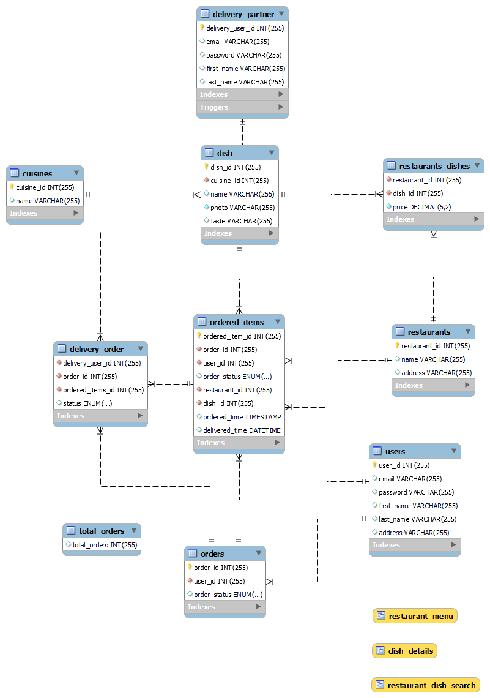

# DS_5110_Tomato

This is my final year project for DS 5110 course at Northeastern University. In this project I have designed a databased for real time food ordering. The web-platform was developed on top of it for user experience using HTML, JavaScript and PHP.

## ER Diagram

The below given diagram explains how different entities are related to one another. Different primary and foreign keys are highlighted. The arrows and their design signifies the different types of relationships between the entities.

